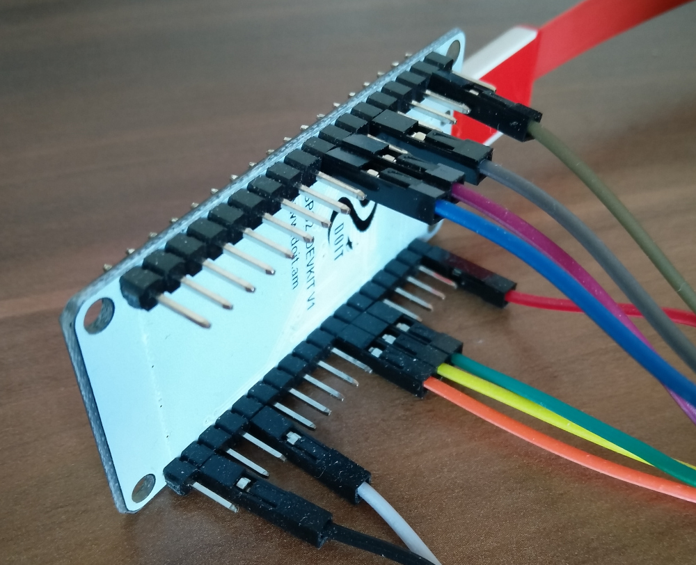
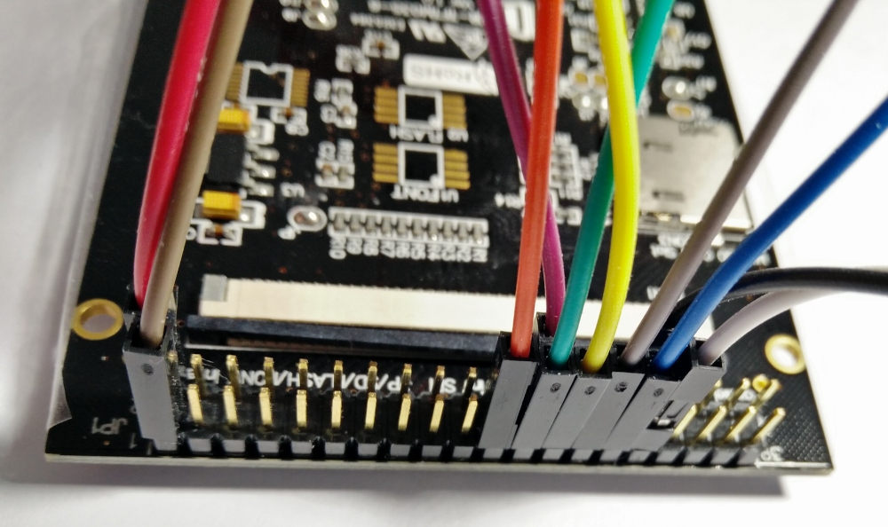
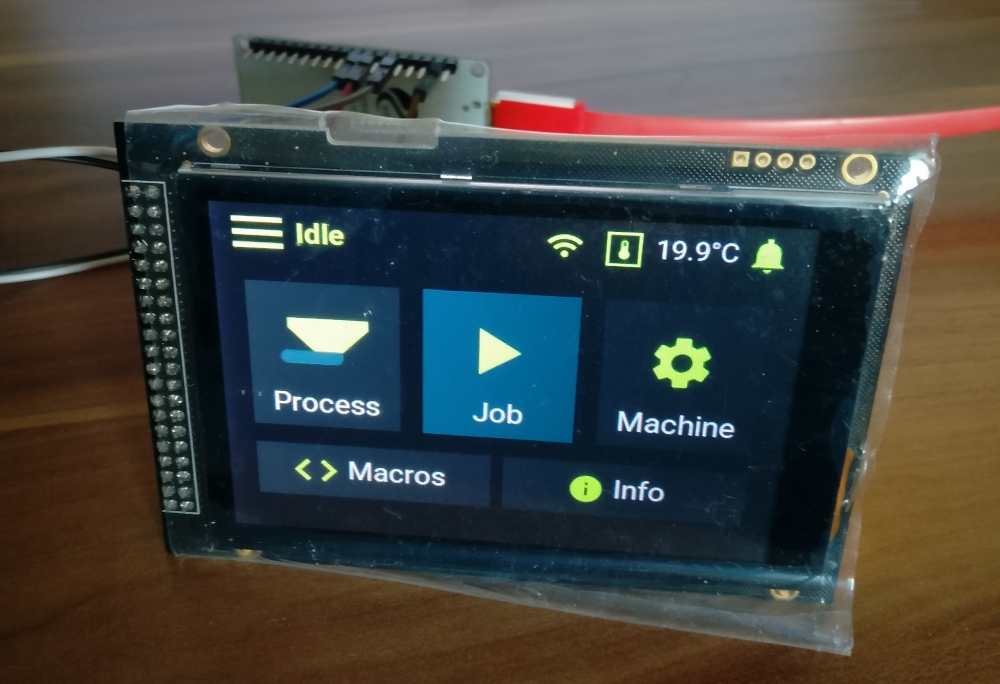

# RepPanel

A simple user interface for Duet/RepRap based 3D printers. Optimized for 3.5" touch
panels controlled via SPI & I²C using an ESP32.

Supports wireless connection or wired via UART/PanelDue port (future release).

An open source alternative to the PanelDue.
  - Cheap (~18€ display + 7€ ESP32)
  - Beautifully dark
  - Compact and easy to use
  - Support for most operations required to set up a 3D print
  - Wireless connection - portable with power bar
  - PanelDue-port/UART connection **(future release)**


## Features
Since RepPanel boots in ~1 second you can start setting up your printer in no time and with no additional hardware.
No need to get the laptop and log in to DuetWebControl. No need to get mad over using WebControl in your smartphones
browser.

 - Start, Stop, Pause & Resume print jobs based of Duets SD card
 - Simulate print jobs
 - Delete print jobs
 - Run macros (no dictionary support yet)
 - Home X, Y, Z or All axis
 - Load/Unload filament per tool
 - Set bed temperatures
 - Set tool temperatures
 - Monitor temperatures
 - Monitor print job:
   - Percent complete
   - Duration
   - Elapsed time (based of simulation, otherwise from file)
   - Job name
   - Current layer
 - Run manual and automated bed leveling
 - Automatic reconnection
 - Low latency

[](https://www.youtube.com/watch?v=39FKTUVjrxc)

## What this project is not
A full replacement for the DuetWebControl interface.

## Supported Hardware/Software
The RepPanel project is based on the [Littlevgl port for the ESP32](https://github.com/littlevgl/lv_port_esp32).
In theory This means all displays and touch controllers supported by the **lv_port_esp32** project are also supported
by RepPanel.

**Tested Hardware**
  - ESP32 DevKit
  - [ER-TFTM035-6 display with capacitive touch screen](https://www.buydisplay.com/lcd-3-5-inch-320x480-tft-display-module-optl-touch-screen-w-breakout-board)

Other display modules with a resolution of 480x320 should also work as long as they are supported by **lv_port_esp32**

**As of now RepPanel is optimized for 3.5" displays with a resolution of 480x320 pixels. The display is connected via SPI.**

**Tested Firmware**
  - Duet2 WiFi with RepRap Firmware v3.0 and corresponding Duet2WebControl

**All Duet2 boards or newer with RepRap Firmware v3.x should work.**

## Installation

### Compile yourself
**Set up ESP-IDF**

[Follow instructions](https://docs.espressif.com/projects/esp-idf/en/v4.0/get-started/index.html#step-1-install-prerequisites) on offical Espressif site.

**Clone Project**

```bash
git clone --recurse-submodules https://github.com/seeul8er/RepPanel_ESP32
```

**Configure Project**

**Temporary workaround:**  
Copy file content of `main/lv_conf_back.h` over to `externals/lv_port_esp32/components/lvgl/lv_conf.h`

From its root run:
```bash
idf.py menuconfig
```
**See [Littlevgl port for the ESP32](https://github.com/littlevgl/lv_port_esp32) for further and more detailed instructions.**

**Compile & Flash**
```bash
idf.py build
idf.py -p (YOUR PORT) flash
```
**See [Littlevgl port for the ESP32](https://github.com/littlevgl/lv_port_esp32) for further and more detailed instructions.**

### Use ready made images
**Ready made images are only available for selected hardware combinations! Please compile the project by yourself in
case you use different hardware or want a different pin connection layout**

Check out [releases](https://github.com/seeul8er/RepPanel_ESP32/releases) for compiled binaries.

### Wiring ER-TFTM035-6 to the ESP32 DevKit with 36GPIOs

**Beware: The available development boards have different pin configurations. Some have GND & 3.3V at the bottom. Others at the top.**



Pin configuration of ready made images:
| **Pin Number** 	| **Function** 	|      **Description**      	|
|:--------------:	|:------------:	|:-------------------------:	|
|     GPIO 13    	|     MOSI     	|      Data line to TFT     	|
|     GPIO 14    	|      SCL     	|      SPI CLK for TFT      	|
|     GPIO 15    	| Slave Select 	|            SPI            	|
|     GPIO 22    	|      SCL     	|        I²C - touch        	|
|     GPIO 21    	|      SDA     	|        I²C - touch        	|
|     GPIO 4     	|     Reset    	|        TFT related        	|
|     GPIO 2     	|     Data     	|        TFT related        	|
|     GPIO 27    	|   Backlight  	| Turn on/off TFT backlight 	|

## Screenshots



## For Developers
[Check out the simulator project.](https://github.com/seeul8er/RepPanel_sim) Simulates the RepPanel GUI on Desktop computers for more efficient testing and implementation.

## Known Bugs
- Multiple tools supported but not tested
- Can not list all files within a directory in case DuetWebControl API requires multiple requests per listing
  - Workaround: Delete files to reduce file count to make all files fit within one response
