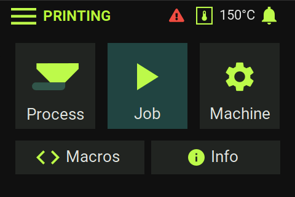
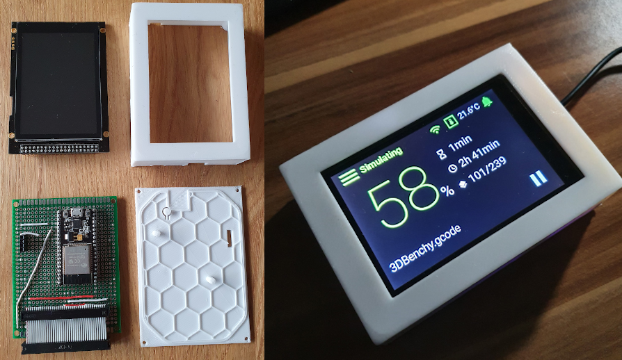
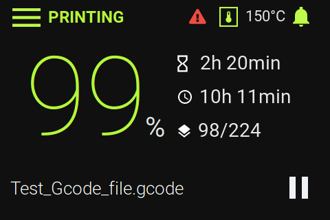
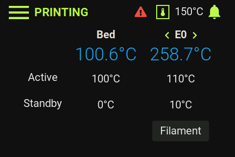
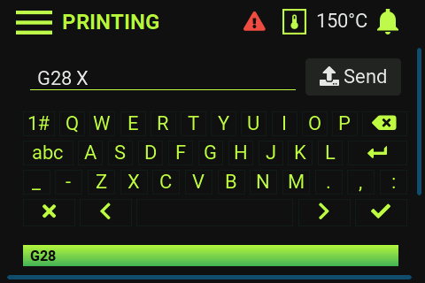
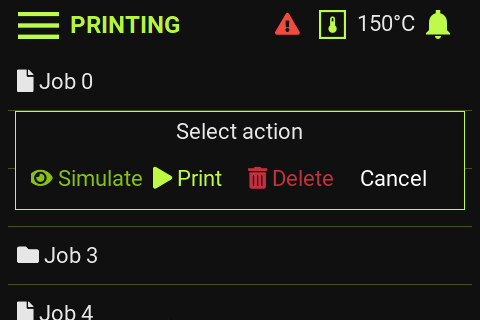

# RepPanel

A simple user interface for Duet/RepRap based 3D printers. Optimized for 3.5" touch
panels controlled via SPI & I²C using an ESP32.

Supports wireless connection or wired via UART/PanelDue port.

An open source alternative to the PanelDue.
  - Cheap (~18€ display + 7€ ESP32)
  - Beautifully dark
  - Compact and easy to use
  - Support for most operations required to set up a 3D print
  - Wireless connection - portable with power bar
  - PanelDue-port/UART connection



## Features
Since RepPanel boots in ~1 second you can start setting up your printer in no time and with no additional hardware.
No need to get the laptop and log in to DuetWebControl. No need to get mad over using WebControl in your smartphones
browser.

 - Start, Stop, Pause & Resume print jobs based of Duets SD card
 - Simulate print jobs
 - Delete print jobs
 - Run macros (no dictionary support yet)
 - Home X, Y, Z or All axis
 - Set extruder fan speed
 - Load/Unload filament per tool
 - Set bed temperatures
 - Set tool temperatures
 - Monitor temperatures
 - Monitor print job:
   - Percent complete
   - Duration
   - Elapsed time (based of simulation, otherwise from file)
   - Job name
   - Current layer
 - Run manual and automated bed leveling
 - Automatic reconnection
 - Low latency


[](https://youtu.be/FfghWz1Lrw4)  
[](https://www.youtube.com/watch?v=39FKTUVjrxc)

## What this project is not
A full replacement for the DuetWebControl interface.

## Supported Hardware/Software
The RepPanel project is based on the [LVGL port for the ESP32](https://github.com/lvgl/lv_port_esp32/tree/c1f43bfb090df293059ab52baabbdbdd8df00712).
In theory this means all displays and touch controllers supported by the **lv_port_esp32** project are also supported
by RepPanel.

**Tested Hardware**
  - ESP32 DevKit
  - [ER-TFTM035-6 display with capacitive touch screen, 4-Wire SPI, No font chip required](https://www.buydisplay.com/lcd-3-5-inch-320x480-tft-display-module-optl-touch-screen-w-breakout-board)

**Beware: There are numerous version of the ER-TFT035-6. You must choose the one with the SPI interface. Do not get the arduino shield version (no SPI config). The version with the screen breakout board is sufficient.**  
Other display modules with a resolution of 480x320 should also work as long as they are supported by `lv_port_esp32`  
As of now RepPanel is optimized for 3.5" displays with a resolution of 480x320 pixels. The display is connected via SPI.

**Tested Firmware**
  - Duet2 WiFi running RepRap Firmware v3.0 and corresponding Duet2WebControl
  - Duet2 WiFi running RepRap Firmware v3.1 and corresponding Duet2WebControl

## Installation
Use ready made images or compile yourself.

### Compile yourself

#### Set up ESP-IDF

[Follow instructions](https://docs.espressif.com/projects/esp-idf/en/v4.0/get-started/index.html#step-1-install-prerequisites) on offical Espressif site.  
ESP-IDF v4.0 is officially supported.

#### Clone Project

```bash
git clone --recurse-submodules https://github.com/seeul8er/RepPanel_ESP32
```
LVGL v7 is not supported. Last tested release of `lv_port_esp32` is commit `c1f43bfb090df293059ab52baabbdbdd8df00712`

#### Configure Project

**Update lv_conf.h**  
Copy file content of `main/lv_conf_back.h` over to `externals/lv_port_esp32/components/lvgl/lv_conf.h`.  
Or simply add:
- Set `LV_USE_USER_DATA 1`
- Add `#define LV_USE_THEME_REP_PANEL_DARK 1`
- Set `LV_INDEV_DEF_DRAG_THROW 85` to decrease DMA usage and increase stability
- `CONFIG_LVGL_FONT_ROBOTO16` & `CONFIG_LVGL_FONT_ROBOTO22` must be activated
- Add 
```C
#define LV_FONT_CUSTOM_DECLARE  LV_FONT_DECLARE(reppanel_font_roboto_bold_16) \
                                       LV_FONT_DECLARE(reppanel_font_roboto_bold_18) \
                                       LV_FONT_DECLARE(reppanel_font_roboto_bold_24) \
                                       LV_FONT_DECLARE(reppanel_font_roboto_regular_26) \
                                       LV_FONT_DECLARE(reppanel_font_roboto_light_26) \
                                       LV_FONT_DECLARE(reppanel_font_roboto_thin_numeric_160) \
                                       LV_FONT_DECLARE(reppanel_font_roboto_regular_percent_40)
```

From its root run:
```bash
idf.py menuconfig
```
**See [LVGL port for the ESP32](https://github.com/lvgl/lv_port_esp32/tree/c1f43bfb090df293059ab52baabbdbdd8df00712) for further and more detailed instructions.**

#### Compile & Flash
```bash
idf.py build
idf.py -p (YOUR PORT) flash
```
**See [LVGL port for the ESP32](https://github.com/lvgl/lv_port_esp32/tree/c1f43bfb090df293059ab52baabbdbdd8df00712) for further and more detailed instructions.**

### Use ready made images
Ready made images are only available for selected hardware combinations! Please compile the project by yourself in
case you use different hardware or want a different pin connection layout

Check out [releases](https://github.com/seeul8er/RepPanel_ESP32/releases) for compiled binaries.

### Wiring ER-TFTM035-6 to the ESP32 DevKit

**Beware:** The available development boards have different pin configurations. Some have GND & 3.3V at the bottom. Others at the top.

Pin configuration of ready made images:
| **Pin Number ESP32 ** |  **Pin Number ER-TFTM035-6** | **Function** | **Description** |    
|:--------------:|:--:|:------------:   |:-------------------------:   |    
|     VCC 3.3V   |  2 |     Power supply | Match TFT voltage with ESP32 pin |    
|     GND        | 1  |      GND          |           Ground             |   
|     GPIO 13    | 27 |     MOSI         |      Data line to TFT        |    
|     GPIO 14    | 24 |      SCL         |      SPI CLK for TFT         |    
|     GPIO 15    | 23 | Slave Select     |            SPI               |    
|     GPIO 22    | 30 |      SCL         |        I²C - touch           |    
|     GPIO 21    | 31 |      SDA         |        I²C - touch           |    
|     GPIO 4     | 21 |   Reset          |        TFT related           |    
|     GPIO 2     | 25 |   Data           |        TFT related           |    
|     GPIO 27    | 29 |   Backlight      | Turn on/off TFT backlight    |    
|     GPIO 17    |  - |   UART TX        | Connect to RX PanelDue port  |    
|     GPIO 16    |  - |   UART RX        | Connect to TX PanelDue port  |

## Screenshots






## For Developers
[Check out the simulator project.](https://github.com/seeul8er/RepPanel_sim) Simulates the RepPanel GUI on Desktop computers for more efficient testing and implementation.

## Known Limitations
- Multiple tools supported but not tested
- Auto swap from UART to WiFi connection might take up to 10s
- Entries per directory listing limited to 16 for jobs and macros
- Directory path limited to 128 characters
- Filament listing (all filament names separated by one character) limited to 1014
- Can not list all files within a directory in case DuetWebControl API requires multiple requests per listing
  - Workaround: Delete files to reduce file count to make all files fit within one response
  
## Known Bugs
- Messages printed by G-Code commands can not be "clicked away"
- Irregular freezes of the screen with RRF 3.1
